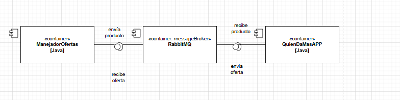
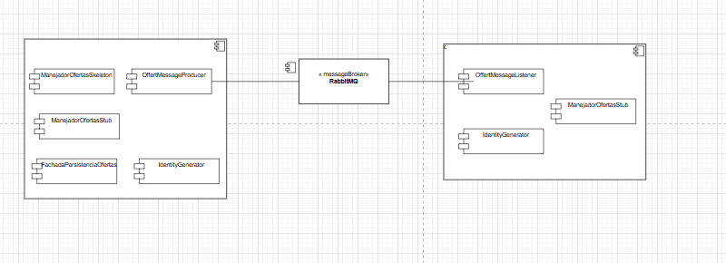

Carolina Cepeda Valencia - Parcial 2

Se completa el método Onmessage para que al recibir un producto se llame al servicio agregar oferta del proyecto de manejador de ofertas, para hacerlo también se añadió la clase ManejadorOfertasStub.java para que ambos proyectos conozcan el contrato.

## Diagramas
A continuación se observa un diagrama base mostrando la relación con RabbitMQ como messageBroker

Se puede observar de forma más detallada el funcionamiento de los diferentes componentes, teniendo en cuenta que se tomó el contrato ManejadorOfertasStub en ambos proyectos:

